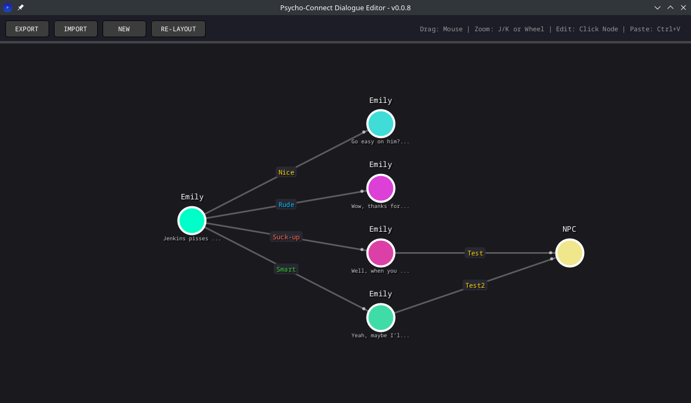

# Psycho-Connect Dialogue Editor

**Visual Dialogue Graph Editor for Narrative Games**

---



---

## Overview

**Psycho-Connect Dialogue Editor** is a free and open-source, node-based dialogue editor built in **Processing**. It is designed for narrative-heavy games, visual novels, RPGs, and experimental interactive fiction where dialogue structure, player intent, and NPC reaction matter as much as the text itself.

The editor allows authors to visually construct branching dialogue graphs composed of **Stations (nodes)** and **Routes (choices)**, including metadata such as response type, trust impact, and NPC reactions.

This project is currently a **prototype**, but fully functional and actively usable.

---

## Key Features

### Node-based dialogue graph
- Each node represents a dialogue *station*
- Directed edges represent player choices

### Rich choice metadata
- Choice *type* (e.g. Nice, Rude, Intelligent, etc.)
- Player response text
- NPC reaction text
- Trust score modifier
- Explicit target node linking

### Visual auto-layout
- Automatic hierarchical layout from root
- Re-layout at any time

### Expanded text editor
- Modal large text editor for long dialogue
- Keeps main UI uncluttered

### Live editing
- Changes propagate immediately to graph and data
- No separate "apply" step

### JSON import/export
- Human-readable format
- Backwards-compatible with earlier schema versions

### Autosave
- Automatic save every 30 seconds (`autosave.json`)

### Single-file architecture
- Entire editor contained in one `.pde` file
- Easy to audit, modify, or fork

---

## Requirements

- **Processing 4.x**  
  Download from: https://processing.org/download

- Java is bundled with Processing (no separate install required)

**Tested on:**
- Linux
- Expected to work on Windows and macOS

---

## How to Run

### 1. Install Processing

Download and install Processing from:
https://processing.org/download

### 2. Clone the Repository

```bash
git clone https://github.com/Enrique-ZA/psycho-connect-dialogue-editor.git
cd psycho-connect-dialogue-editor
```

Or download the ZIP and extract it.

### 3. Open the Sketch

- Launch **Processing**
- Open the file: `PsychoConnectDialogueEditor.pde`

### 4. Run

- Click **Run** (▶)
- The editor window will open immediately

---

## Basic Usage

### Navigation

- **Left-click node** → Open station editor
- **Drag empty space** → Pan camera
- **Mouse wheel / J / K** → Zoom
- **Re-Layout** → Auto-arrange graph

---

## Stations (Nodes)

Each station contains:

- **NPC Name**
- **Dialogue text**
- A list of outbound routes (choices)

The root station is created automatically and cannot be deleted.

---

## Routes (Choices)

Each route includes:

| Field | Description |
|-------|-------------|
| Type | High-level intent or tone (used as graph label) |
| Player Response | Text the player selects |
| NPC Reaction | Immediate NPC response |
| Trust | Integer modifier |
| Link ID | Target station ID |

Deleting a route also deletes its target station and cleans all references.

---

## Expanded Text Editor

Clicking on most text fields opens a **modal expanded editor**, suitable for long dialogue or reactions.

- **OK** → Save changes
- **Cancel** → Discard changes

---

## File Format (JSON)

Exported dialogue is stored as a single JSON file.

**Example (simplified):**

```json
{
  "nodes": [
    {
      "id": "stn_1A2B",
      "npcName": "Guard",
      "dialogue": "Halt! Who goes there?",
      "color": 16776960,
      "choices": [
        {
          "type": "Polite",
          "response": "Just a traveler.",
          "reaction": "The guard relaxes slightly.",
          "trust": 1,
          "targetId": "stn_3F9C"
        }
      ]
    }
  ]
}
```

### Compatibility

- Older versions using `"text"` instead of `"type"` are automatically handled on import
- Missing fields are safely defaulted

---

## Project Status

**Prototype**

This means:

- Core features are stable
- UI and workflow may change
- Data format is mostly stable but may expand

**Not yet included:**

- Undo / redo
- Search
- Validation of broken links
- Multiple root nodes
- Runtime dialogue simulation

---

## Philosophy

This project prioritizes:

- **Author clarity over engine lock-in**
- **Explicit structure over hidden logic**
- **Readable data over proprietary formats**
- **Hackability over abstraction**

The editor is engine-agnostic and intended to slot into custom pipelines.

---

## License

**MIT License**

You are free to:

- Use
- Modify
- Fork
- Redistribute
- Integrate into commercial or non-commercial projects

Attribution is appreciated but not required.

---

## Contributions

Contributions are welcome.

**Suggested areas:**

- UX improvements
- Keyboard navigation
- Graph validation
- Schema extensions
- Documentation
- Exporters (Ink, Yarn, Ren'Py, Godot, Unity, etc.)

Please keep changes consistent with the single-file Processing architecture unless discussed.

---

## Author

Created by **Enrique Nelson**

---
